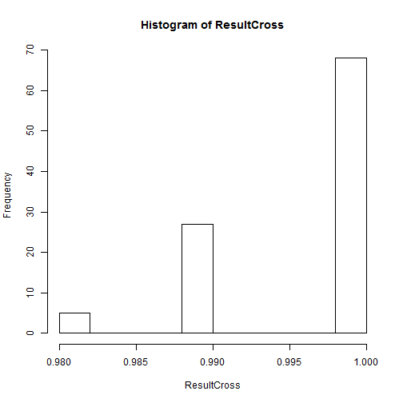

Practical Machine Learning: Course Project Writeup
========================================================

##Introduction

Using devices such as Jawbone Up, Nike FuelBand, and Fitbit it is now possible to collect a large amount of data about personal activity relatively inexpensively. These type of devices are part of the quantified self movement - a group of enthusiasts who take measurements about themselves regularly to improve their health, to find patterns in their behavior, or because they are tech geeks. One thing that people regularly do is quantify how much of a particular activity they do, but they rarely quantify how well they do it. This project will use data from accelerometers on the belt, forearm, arm, and dumbell of 6 participants. The participants were asked to perform barbell lifts correctly and incorrectly in 5 different ways. The goals of the project is to build a machine learning model to predict the type of movement, i.e. "A", "B", "C", "D" or "E".

##Data

The dataset is devided between a training set (pml.training) and a test set (pml.testing). The training set will be used for training, cross-validation, and model testing, while the test set will be used for the Course Project Submission. The actual predictions from the test set will be reported at the end.

Note that the data contains several summary variables (kurtosis, mean, etc.) with a large number of NA-values. Since these cannot be used to predict the test set, all summary values will be discarded and only the raw movement-data will be used for this assignment. The following code will load, clean and seperate the raw data into the relevant datasets:


```r
#Set working directory
setwd("~/GitHub/MachineLearningAssignment")

#Load packages
library(caret)
```

```
## Loading required package: lattice
## Loading required package: ggplot2
```

```r
library(randomForest)
```

```
## Warning: package 'randomForest' was built under R version 3.1.1
```

```
## randomForest 4.6-7
## Type rfNews() to see new features/changes/bug fixes.
```

```r
#Load data
pml.training <- read.csv("pml-training.csv")
pml.testing <- read.csv("pml-testing.csv")

#The final test data set
Vnames <- names(pml.testing[1,!is.na(pml.testing[1,])])
DataTempTest <- pml.testing[,paste(Vnames)]
DataTest <- DataTempTest[,-7:-1]

#Combine relevant variables into one dateset
Vnames <- names(pml.training[1,!is.na(pml.testing[1,])])
DataTemp <- pml.training[,paste(Vnames)]
Data <- DataTemp[,-7:-1]

#Create validation traning and test set out of the original training set
set.seed(123)
inTrain = createDataPartition(Data$classe, p = 4/5)[[1]]
training = Data[ inTrain,] #Training validation set
testing = Data[-inTrain,] #Test validation set
```

##Cross-Validation

In order to perform cross validation, I will create 100 different samples, with each sample containing 100 observations. The samples are taken from the cross-validation training set (training), and sampling is conducted without replacement. Hereafter, I will train the model via the remaining data and report the accuracy for the cross-validation prediction. The random forrest model has been selected for this assignment and will be used for the final model submission. The analysis will be conducted via the following code:


```r
set.seed(123)
KchunkId <- replicate(100,sample(1:nrow(training), 100, replace = FALSE))
ResultCross <- vector(length=ncol(KchunkId)) #Construct vector to store cross-validation results
for ( i in 1:ncol(KchunkId)) {
  CrossTrain <-  training[-KchunkId[,i],] #Define training set for cross-validation
  CrossValidate <-  training[KchunkId[,i],] #Define test set for cross-validation
  modCross <- randomForest(classe ~ ., data=CrossTrain) #Training the random forest model
  PredCross <- predict(modCross, CrossValidate) #Predicting the cross-validation test sample
  ResultCross[i] <- sum(PredCross == CrossValidate$classe) / nrow(CrossValidate) #Estimating the accuracy
}
```

Now we plot distribution of the cross-validation test results, summarize the values via the table function and estimate the mean:


```r
hist(ResultCross)
```

 

```r
table(ResultCross)
```

```
## ResultCross
## 0.98 0.99    1 
##    5   27   68
```

```r
mean(ResultCross)
```

```
## [1] 0.9963
```

Given results of the cross-validation, it seems that the model is highly accurate:
1) 0% prediction error in 68% of cases
2) 1% prediction error in 27% of cases
3) 2% prediction error in 5% of cases
4) >2% prediction error in 0% of cases
5) Average prediction accuracy: 99.63%

Given these results, I would expect a prediction accuracy above 99% when training the model on the entire validation training dataset (training) and testing it on the validation test set (testing).

##Validation of Random Forest Model

I am now training the model on the entire validation training set (training) and testing it on the validation test set (testing).  


```r
modRF <- randomForest(classe ~ ., data=training) #Training the random forest model
PredRF <- predict(modCross, testing) #Predicting the validation sample
sum(PredRF == testing$classe) / nrow(testing) #Estimating the accuracy
```

```
## [1] 0.9969
```

According to the results, the model has a test accuracy of 99.69%, which is extremely close to the average accuracy estimated in the cross validation. Hence, I would deem the accuracy good enough for application on the final test sample.

##Application of Model on Test Sample for Final Submission

Now we are using the random forest model on the entire training set to produce predictions for the test set:

```r
modFinal <- randomForest(classe ~ ., data=Data) #Training the random forest model
PredFinal <- predict(modFinal, DataTest) #Predicting via the estimated random forest model
paste(PredFinal) #Show the final results
```

```
##  [1] "B" "A" "B" "A" "A" "E" "D" "B" "A" "A" "B" "C" "B" "A" "E" "E" "A"
## [18] "B" "B" "B"
```
These results where applied in the final project submission and achieved an accuracy rate of 100%.
